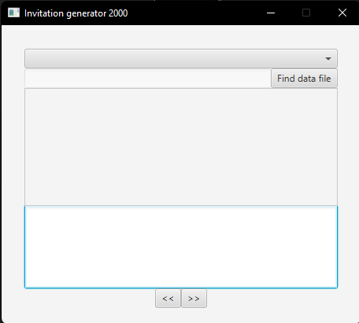
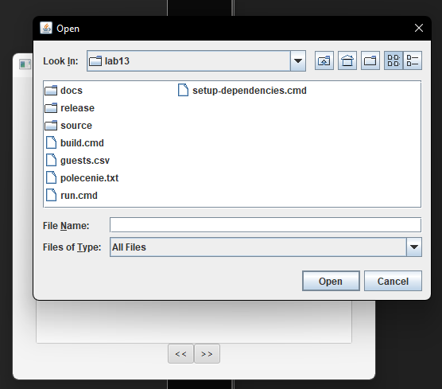
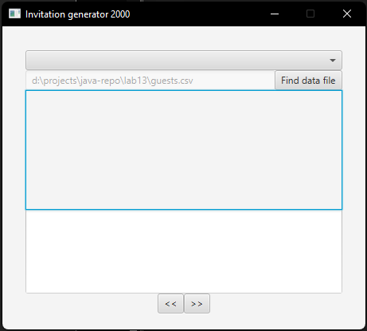
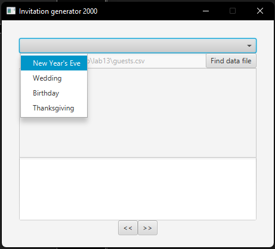
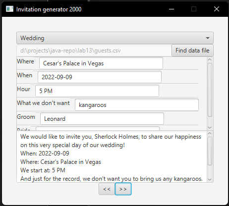
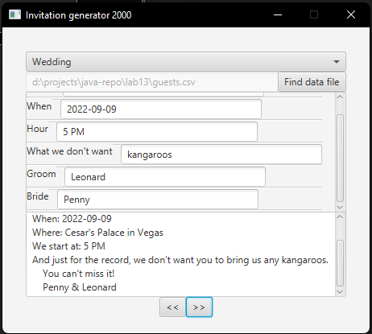
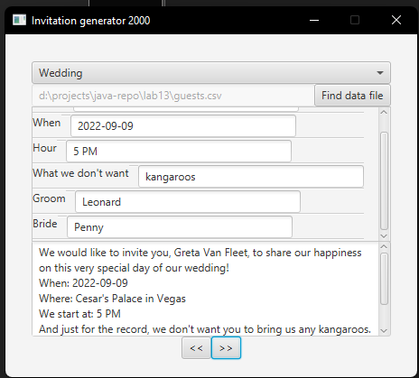

# Generator zaproszeń
Aplikacja jest generatorem zaproszeń na różne okazje.  
W tej chwili wspierane są cztery szablony: Sylwester, wesele, urodziny i Święto Dziękczynienia.

Cała logika działania aplikacji została napisana w języku JavaScript wewnątrz pliku fxml,
jednak część biblioteczna została napisana jako kod Java - chodzi przede wszystkim
o ładowanie szablonu z pliku xml oraz danych gości z pliku csv.

## Uruchomienie

Aplikacja jest wykonywalnym archiwum JAR, zatem wystarczy go dwukrotnie kliknąć lub
wywołać odpowiednią komendę:

    java -jar path/to/jar/jsfx-1.0-SNAPSHOT.jar

Archiwum nie jest typu standalone, czyli wymaga pobrania zależności i umieszczenia ich
w tym samym co aplikacja folderze. Najprościej użyć do tego celu skryptu setup-dependencies.cmd.

## Działanie

Aby użyć aplikacji, należy wybrać plik csv z danymi gości. Służy do tego przycisk
"Find data file". Jego naciśnięcie otwiera dialog pozwalający wybrać plik z systemu
plików.

Plik z danymi gości musi zawierać dwie kolumny o nazwach "firstName" i "lastName" (kolejność nie ma znaczenia).

Z rozwijanego menu należy wybrać szablon zaproszenia, wtedy pojawią się pola na dane,
którymi chcemy uzupełnić szablon. Pola różnią się w zależności od szablonu.

Po uzupełnieniu pól przyciskami na dole można nawigować pomiędzy kolejnymi zaproszonymi gośćmi, tekst zaproszenia wyświetla się w polu na dole.

